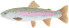

# Small Worlds and Large Worlds


```{r setup, include=FALSE}
knitr::opts_chunk$set(dev.args = list(png = list(type = "cairo")), message = F, warning = F, error = F)
library(resourceviz)
library(ggtext)
library(ggplot2)
library(dplyr)
colorize <- function(x, color = "#1d33cc", caps = TRUE) {
  if (caps) {
    sprintf("<span style='text-transform: uppercase; color: %s;'>%s</span>", color,
      x)
  } else {
    sprintf("<span style='color: %s;'>%s</span>", color,
      x)
  }
}
ggplot2::theme_set(custom_theme())
```


## Small Worlds and Large Worlds  

A great distinction between the small and large world is the _small world_ is the model itself and the _large world_ is the world we hope to deploy in. This is the challenge of statistical modeling and is elevated by forgetting this distinction.  

In the small world there are no surprises and it is important to verify the logic, making sure that it performs as expected under favorable assumptions.  

The large world has events that were not expected or imagined in the small world, e.g. coupling of events, a priori understanding is misleading, etc. This is essentially the modeling adage 'all models are wrong, but some are useful'. Just because the model in the small world makes logical sense doesn't mean that it will be consistent in the large world. As Richard says, 'But it is certainly a warm comfort.' 

This chapter is where you'll start building Bayesian models. Bayesian models learn from prior information and this is super helpful in the small world. If this assumptions are close to reality, then they are also great in the large world.  

## Garden of forking paths  

This is the humble beginnings of Bayesian inference: counting and comparing possibilities. Richard compares this to Jorge Luis Borges' short story "The Garden of Forking Paths." In short, life is full of paths and exploring all of them will help make good inference. As we learn. We prune. This inference might not give a correct answer in the large world but it can guarantee the best possible answer in small world, given the information fed to it.  

### Counting possibilities  

Here we'll take a play on the marble scenario but use fish in a bucket. Let's say you have a stream with either Bull Trout (_salvelinus confluentus_) or Rainbow Trout (Oncorhynchus Mykiss) and let's say there are 4 samples from that stream. There are five different possibilities in these samples: some with all and some mixed,  

```{r figure-1,fig.cap='Possibilities in the bucket.', echo = F}
library(tidyverse)
library(ggsvg)
d <-
  tibble(p1 = 0,
         p2 = rep(1:0, times = c(1, 3)),
         p3 = rep(1:0, times = c(2, 2)),
         p4 = rep(1:0, times = c(3, 1)),
         p5 = 1)

head(d)
svg_file <- knitr::include_graphics('images/salvelinus-confluentus-bull-trout.svg')
svg_file2 <- 
svg_text <- paste(readLines(svg_file), collapse = "\n")
svg_text2 <- paste(readLines(svg_file2), collapse = "\n")

d %>% 
  gather() %>% 
  mutate(x = rep(1:4, times = 5),
         possibility = rep(1:5, each = 4),
         fill = if_else(value == 0, 'Rainbow Trout', 'Bull Trout')) %>% 
  ggplot(aes(x, possibility)) +
  geom_point_svg(aes(x, possibility, svg = fill), 
                 size = 25) + 
  scale_svg_discrete_manual(
    aesthetics = 'svg', 
    values = c(`Bull Trout` = svg_text, `Rainbow Trout` = svg_text2),
    guide = guide_legend(override.aes = list(size = 20))
  ) +
  scale_x_continuous(NULL, breaks = NULL) +
  coord_cartesian(xlim = c(.75, 4.25),
                  ylim = c(.75, 5.25)) +
    labs(fill = '', svg = 'Fish Type', title = 'Different Possibilities of Fish in the Bucket') 
```

We want to figure out what conjecture is most plausible, given the evidence about the samples. Let's say that in the first 3 samples (with replacement) you get: Bull Trout, Rainbow Trout, Bull Trout (BT, RB, BT). Then what is the most plausible configuration in the bucket? Let's consider one example; `p2` (possibility #2) from Figure \@ref(fig:figure-1) (BT, RB, RB, RB). This is where the forking paths comes in handy because we can count the ways that this possibility can happen (Figure \@ref(fig:figure-2)), i.e. possibility meaning there is 3 RB and 1 BT in the bucket. 

```{r figure-2, fig.cap="Paths taken in the bucket of forking fish.", echo = F}
  d <-tibble(position = c((1:4^1) / 4^0, 
                      (1:4^2) / 4^1, 
                      (1:4^3) / 4^2),
         draw     = rep(1:3, times = c(4^1, 4^2, 4^3)),
         fill     = rep(c("b", "w"), times = c(1, 3)) %>% 
           rep(., times = c(4^0 + 4^1 + 4^2)))

  lines_1 <-
  tibble(x    = rep((1:4), each = 4),
         xend = ((1:4^2) / 4),
         y    = 1,
         yend = 2)


  lines_2 <-
  tibble(x    = rep(((1:4^2) / 4), each = 4),
         xend = (1:4^3) / (4^2),
         y    = 2,
         yend = 3)

  lines_1 <-
  lines_1 %>% 
  mutate(x    = x - .5,
         xend = xend - .5 / 4^1)


  lines_2 <-
  lines_2 %>% 
  mutate(x    = x - .5 / 4^1,
         xend = xend - .5 / 4^2)

d <-d %>% 
  mutate(denominator = ifelse(draw == 1, .5,
                              ifelse(draw == 2, .5 / 4,
                                     .5 / 4^2))) %>% 
  mutate(position = position - denominator)


# d %>% 
#   ggplot(aes(x = position, y = draw)) +
#   geom_segment(data = lines_1,
#                aes(x = x, xend = xend,
#                    y = y, yend = yend),
#                linewidth = 1/3) +
#   geom_segment(data = lines_2,
#                aes(x = x, xend = xend,
#                    y = y, yend = yend),
#                linewidth = 1/3) +
#   # geom_point_svg(data = bt2, aes(x = position, y = draw), svg = svg_text, size = 10) +
#   # 
#   # geom_point_svg(data = rb2, aes(x = position, y = draw),
#   #                css("path", stroke = 'red'),
#   #                svg = svg_text2, size = 5) +
#   geom_point_svg(aes(position, draw, svg = fill), size = 15) + 
#   scale_svg_discrete_manual(
#     aesthetics = 'svg', 
#     values = c(b = svg_text, w = svg_text2),
#     guide = guide_legend(override.aes = list(size = 8))
#   ) + 
#   theme(legend.position = 'none') + 
#   scale_x_continuous(NULL, limits = c(0, 1), breaks = NULL) +
#   scale_y_continuous(NULL, limits = c(0.75, 3), breaks = NULL) 

lines_1 <-
  lines_1 %>% 
  mutate(remain = c(rep(0:1, times = c(1, 3)),
                    rep(0,   times = 4 * 3)))

lines_2 <-
  lines_2 %>% 
  mutate(remain = c(rep(0,   times = 4),
                    rep(1:0, times = c(1, 3)) %>% 
                      rep(., times = 3),
                    rep(0,   times = 12 * 4)))

d <-
  d %>% 
  mutate(remain = c(rep(1:0, times = c(1, 3)),
                    rep(0:1, times = c(1, 3)),
                    rep(0,   times = 4 * 4),
                    rep(1:0, times = c(1, 3)) %>% 
                      rep(., times = 3),
                    rep(0,   times = 12 * 4))) 

# finally, the plot:
d %>% 
  ggplot(aes(x = position, y = draw)) +
  geom_segment(data = lines_1,
               aes(x = x, xend = xend,
                   y = y, yend = yend,
                   alpha = remain %>% as.character()),
               linewidth = 1/3) +
  geom_segment(data = lines_2,
               aes(x = x, xend = xend,
                   y = y, yend = yend,
                   alpha = remain %>% as.character()),
               linewidth = 1/3) +
  geom_point_svg(aes(position, draw, svg = fill),
                 size = 10) + 
  scale_svg_discrete_manual(
    aesthetics = 'svg', 
    values = c(b = svg_text, w = svg_text2),
    guide = guide_legend(override.aes = list(size = 8))
  ) + 
  # it's the alpha parameter that makes elements semitransparent
  scale_alpha_manual(values = c(1/10, 1)) +
  scale_x_continuous(NULL, limits = c(0, 1), breaks = NULL) +
  scale_y_continuous(NULL, limits = c(0.75, 3), breaks = NULL) +
  theme(legend.position = "none",
        panel.grid = element_blank())

```

In Figure \@ref(fig:figure-2) above, we can see that there is 1 way of getting a bull trout in the first draw, 3 ways in the second and 1 again in the third. We can now do this for all the possibilities. Figure \@ref(fig:figure-2) shows that there are 3 _paths_ or _ways_ for the bag to contain (BT, RB, RB, RB). Now this is great but we need to test all of the ways right? For example, let's say that we wanted to see if the bucket had all RB!? Right, that doesn't make sense. We pulled BT twice so this definitely isn't possible. Same goes for all BT. Since these paths don't exist based on our reality, we know that the way to produce them is 0. Now that we know the ways to produce (BT, RB, RB, RB) and the 0's, let's look at the others in Table \@ref(tab:table-1) below.  

```{r table-1, echo = F}
# if we make two custom functions, here, it will simplify the code within `mutate()`, below
n_bt <- function(x) {
  rowSums(x == "BT")
}

n_rb <- function(x) {
  rowSums(x == "RB")
}

t <-
  # for the first four columns, `p_` indexes position
  tibble(p_1 = rep(c("BT", "RB"), times = c(1, 4)),
         p_2 = rep(c("BT", "RB"), times = c(2, 3)),
         p_3 = rep(c("BT", "RB"), times = c(3, 2)),
         p_4 = rep(c("BT", "RB"), times = c(4, 1))) %>% 
  mutate(`draw 1: Bull Trout`  = n_bt(.),
         `draw 2: Rainbow Trout` = n_rb(.),
         `draw 3: Bull Trout`  = n_bt(.)) %>% 
  mutate(`ways to produce` = `draw 1: Bull Trout` * `draw 2: Rainbow Trout` * `draw 3: Bull Trout`)

t %>% 
  knitr::kable(caption = 'Conjectures and Ways to Produce Fish in a Bucket') 
```

We can see based on our sample that (RB, BT, BT, BT) has 9 ways and (RB, RB, BT, BT) has 8 ways. These 5 different conjectures give us different _paths_ through the garden of forking data and tell us how we could produce (BT, RB, BT). As you can see in Table \@ref(tab:table-1), we just multiply the intermediary steps instead of counting but you'll see later that this is really handy when the conjectures grow.  

### Combining other information  

What if we had information about the relative plausibility of each conjecture? Many ways we might have this but the important point is that it can help us to update these conjectures. In our case there's an easy solution: just multiply the counts.  

Let's consider our initial data and call them _priors_. Now let's say we draw another fish out of the bucket and it's a Bull Trout (BT). We could just start all over again and count the paths, etc or we could just multiply by the new observation and ways to produce it given the conjecture. It turns out these methods are mathematically identical (independent assumption). So to do this, we'll just take the _prior_ counts based on (BT, RB, BT) <=> (0, 3, 8, 9, 0) and multiply by the new ways (0, 1, 2, 3, 4) (Table \@ref(tab:table-2)).  

```{r table-2, echo=F}

t <-
  # for the first four columns, `p_` indexes position
  tibble(p_1 = rep(c("BT", "RB"), times = c(1, 4)),
         p_2 = rep(c("BT", "RB"), times = c(2, 3)),
         p_3 = rep(c("BT", "RB"), times = c(3, 2)),
         p_4 = rep(c("BT", "RB"), times = c(4, 1))) %>% 
  mutate(`draw 1: Bull Trout`  = n_bt(.),
         `draw 2: Rainbow Trout` = n_rb(.),
         `Ways to Produce: Bull Trout`  = n_bt(.)) %>% 
  mutate(`Prior counts` = `draw 1: Bull Trout` * `draw 2: Rainbow Trout` * `Ways to Produce: Bull Trout`) %>% 
  select(-`draw 1: Bull Trout`, - `draw 2: Rainbow Trout` ) %>% 
  mutate(`New count`=`Ways to Produce: Bull Trout`* `Prior counts`)

t %>% 
  knitr::kable(caption = 'Updating priors with new data.') 
```


This is great because as new data arrives we can just update!  


### From counts to probability  

Counts are great as a pedagogical example of how the garden of forking data works but as the data grows counts will be become difficult to work with (imagine having ten fish in a bucket). All of this becomes easier when we compress it into a formula and use multiplication. Let's look at the previous example but now within a formula and _speaking_ it out.    

$$
\text{plausibility of} \ p \ \text{after} \ D_{new} \ \propto \ \text{ways} \ p \ \text{can produce} \ D_{new} \ \times \ \text{prior plausibility of } p
$$  

We can say this now as, "the plausibility of $p$ (B, R, R, R) after $D_{new}$ (drawing B, R, B) is proportional ($\propto$) to the ways $p$ (B, R, R, R) we can produce $D_{new}$ (drawing B, R, B) multiplied ($times$) by the prior plausibility of $p$ (B, R, R, R). This is really just formalizing what we did in the previous section but now we can scale this up. Now to go from counts to probabilities we need to divide the rhs of the equation by the sum of the products (ways to produce data), (Table \@ref(tab:table-3)).  

$$
\text{plausibility of} \ p \ \text{after} \ D_{new} \ = \frac{\text{ways} \ p \ \text{can produce} \ D_{new} \ \times \ \text{prior plausibility of } p}{\text{sum of products}}
$$  
```{r table-3, echo=F}

t <-
  # for the first four columns, `p_` indexes position
  tibble(p_1 = rep(c("BT", "RB"), times = c(1, 4)),
         p_2 = rep(c("BT", "RB"), times = c(2, 3)),
         p_3 = rep(c("BT", "RB"), times = c(3, 2)),
         p_4 = rep(c("BT", "RB"), times = c(4, 1))) %>% 
  mutate(p  = c(0,0.25,0.5,0.75,1),
         `Ways to Produce: Bull Trout` = c(0,9,8,3,0),
         sum_of_products = sum(`Ways to Produce: Bull Trout`)) %>% 
  mutate(Plausibility = (`Ways to Produce: Bull Trout`)/sum_of_products) %>% 
  select(-sum_of_products)

t %>% 
  knitr::kable(caption = 'From counts to probabilities... or is it plausibilities?') 
```

You might be thinking is this a plausibility or _probability_? Exactly. It's confusing but simply the plausibilites are the probabilities and come with all of the mathematical things in probability theory. @mcelreath2018statistical then goes over the common names for things in probability theory:  


:::{.b--gray .ba .bw2 .ma2 .pa4 .shadow-1}
* A conjectured proportion of bull trout (BT), $p$, is usually called a `r colorize("parameter", "#1d33cc")` value.
It’s just a way of indexing possible explanations of the data.
* The relative number of ways that a value $p$ can produce the data is usually called
a `r colorize("likelihood", "#1d33cc")`. It is derived by enumerating all the possible data sequences that
could have happened and then eliminating those sequences inconsistent with the
data.
* The prior plausibility of any specific $p$ is usually called the `r colorize("prior probability", "#1d33cc")`.
* The new, updated plausibility of any specific $p$ is usually called the
`r colorize("posterior probability", "#1d33cc")`.  

-- @mcelreath2018statistical
:::

The next section builds on this framework and helps bring it it together in a simple toy example.  

## Building a Model  

The globe problem always reminded me of a similar hydrology example with predicting headwater streams (@erickson2023modeling). We can look at the streams across the landscape similar to how we look at a tossing globe. Instead of trying to understand the proportion of water on the globe, we want to know the proportion of streams within a watershed.  

First we need to sample a _theoretical_ stream network across a watershed and just like the globe if we get an observation on a stream or not we should be able to generate a posterior distribution. We'll look at the National Hydrography Dataset Plus  High Resolution (NHDPlus HR) raster in Northwest Montana and sample from this raster to get an idea for a proportion of land to water (@blodgett2018nhdplustools). It's not perfect but as you'll see later on it starts to converge pretty quickly and give us a clearer picture of the likelihood.     

```{r warning = F, message = F}
library(terra)

nhdplusHR <- rast('extdata/streamgridMT.tif')
watershed <- vect('extdata/watershed.shp') %>% project(crs(nhdplusHR))

```

```{r figure-3, echo=F, fig.cap='Watershed with NHDPlus HR streams'}
plot(nhdplusHR, col = 'blue')
plot(watershed, add = TRUE, fill = NA)
```


Richard goes into some steps that will help us formulate how the Bayesian model workflow can be done as well as how it's a process (repeated). We'll go through each step in the following sections.  

:::{.b--gray .ba .bw2 .ma2 .pa4 .shadow-1}
(1) `r colorize("Data story", "#1d33cc", F)`: Motivate the model by narrating how the data might arise.
(2) `r colorize("Update", "#1d33cc", F)`: Educate your model by feeding it the data.
(3) `r colorize("Evaluate", "#1d33cc", F)`: All statistical models require supervision, leading possibly to model revision.

-- @mcelreath2018statistical
:::  

### A data story  

This is always a great start but a lot of times overlooked or forgotten, i.e. how the data was generated. We are sometimes looking at data as a way to describe some underlying property or pattern or by looking at it to gain knowledge about the underlying casual mechanisms that drive those underlying properites. Sometimes this back and forth can be difficult (descriptive <-> causal) but in the end the model is just trying to do what you give it with the algorithm it's built to perform (remember golems). Thus, the need to understand the story and _how_ the data is generated is very important to understanding the model. In addition, this is where simulating data will come in handy because it helps you get to the heart of the data generating process and the associated _descriptive <-> causal_ linkages. Below is a simple summary of how we might look at our stream proportion in a watershed model `r colorize('Data story')`.  

:::{.b--gray .ba .bw2 .ma2 .pa4 .shadow-1}

(1) The true proportion of streams covering the watershed is $p$.
(2) A single random sample of the watershed has a probability $p$ of producing a stream (S) observation.
It has a probability 1 − $p$ of producing a land (L) observation.
(3) Each random sample is independent of the others.

-- @mcelreath2018statistical
:::  

It will be much easier though to see it in action and how each sample will update our model and our understanding of the data story. We'll go through this in the next section.  

### Bayesian updating  

Remember the 'fish in a bucket' example earlier where we followed the paths to come up with _ways_ and _plausibilities_, well it's going to be the same process but now we'll just use random samples in the watershed instead. Each time we sample from the watershed, we'll update the posterior plausibility by taking the `r colorize('prior')` and multiplying it by the `r colorize('likelihood')`. We'll call this `r colorize("Bayesian Updating")` and we can see the process happening in Figure \@ref(fig:figure-4). But first, we need to get the data (samples) and then show how it updates after each event.  

So, we'll randomly sample the stream raster in Figure \@ref(fig:figure-3) to get 9 samples of either S (stream) or L (land). 

```{r}
set.seed(2349)

sample9 <- terra::spatSample(nhdplusHR, size = 9, method = "random", replace = TRUE)

## just adding a S and L
sample9$observations <- ifelse(is.na(sample9$streamgrid), 'Land', 'Stream')
```


So from the vector `sample9` we get `r sample9$observations`.  

As you can see it's pretty rare to get a stream with all that land! The first panel in Figure \@ref(fig:figure-4) is important because it shows that our prior (dashed line) is uniform meaning we give equal probability to the proportion of stream in the watershed. We could give a more thought out prior but as a working example we'll just stick with a uniform for now. In later chapters we'll play more with the prior and see how it affects the posterior distribution.

```{r figure-4, echo = F, fig.cap="Bayesian updating based on random samples of a watershed. Notice how once it get's a Land, it knows that it can't be possible to not have Land. Dashed line is the prior and solid line is the likelihood."}
sequence_length <- 50

gg_data <- sample9 %>% 
  mutate(n_trials  = 1:9,
         n_success = cumsum(observations == "Stream")) %>% 
  expand_grid(p_water = seq(from = 0, to = 1, length.out = sequence_length)) %>% 
  group_by(p_water) %>% 
  mutate(lagged_n_trials  = lag(n_trials,  n = 1),
         lagged_n_success = lag(n_success, n = 1)) %>% 
  ungroup() %>% 
  mutate(prior      = ifelse(n_trials == 1, 0.5,
                             dbinom(x    = lagged_n_success, 
                                    size = lagged_n_trials, 
                                    prob = p_water)),
         likelihood = dbinom(x    = n_success, 
                             size = n_trials, 
                             prob = p_water),
         strip      = str_c("n = ", n_trials)) %>% 
  # the next three lines allow us to normalize the prior and the likelihood, 
  # putting them both in a probability metric 
  group_by(n_trials) %>% 
  mutate(prior      = prior      / sum(prior),
         likelihood = likelihood / sum(likelihood))


gg_data %>%
  # plot!
  ggplot(aes(x = p_water)) +
  geom_line(aes(y = prior), linetype = 2) +
  geom_line(aes(y = likelihood)) +
  scale_x_continuous("proportion of streams", breaks = c(0, .5, 1)) +
  scale_y_continuous("plausibility", breaks = NULL) +
  theme(panel.grid = element_blank()) +
  facet_wrap(~strip, scales = "free_y") +
  custom_theme() +
  theme(panel.grid.minor.x  = element_blank())


```

From \@ref(fig:figure-4) we can see that we are taking a 50% probability of getting 'S' or 'L' (even though we know that's not true...) and then updating based on our sample of Land or Stream. So every time `Land` is observed, the peak of the plausibility curve moves to the left in the graph. This repeats with each step and changes the likelihood depending on the priors.  


### Evaluate  

Richard goes into details about the small and large world comparisons and warns practitioner's about the assumptions of the data and model, e.g. assuming the model is the correct model to use and the data in the small world is a representation of the large world. He also makes an important point about how the data is drawn. For example, with the proportion of streams in a watershed it doesn't matter if we draw a stream 2, 3, 8, 20, etc because order doesn't matter but in other situations order _can_ matter and you'd want to make sure your _model_ was aware of this order! In addition, make sure you are aware of the models purpose (prediction, inference, etc) and then check for adequacy within that domain.  

## Components of the model  

Now to the fun part, open up the machine! Here we'll learn how the machine works, part by part. This will help us connect the model (golem) and some statistical properties, e.g. probability theory (distributions).  

### Variables  

Richard explains _variables_ as symbols that take on different values and things we wish to infer (proportions and rates) in addition to things that we actually observe like data. For our stream proportion example there are three variables; $p$, $S$, $L$. 

The first variable $p$ is the proportion of streams in the watershed. This variable cannot be observed but is instead inferred from the data. Richard explains that this is usually called a `r colorize('parameter')`. The other variables are just the observed variables from our samples, e.g. stream and land.  

### Definitions  

Once we have the variables then we need to define them. This will help us achieve all the ways we can count the paths when considering all the variables used (observed and unobserved). I think _define_ in this context is a little _abstract_ as Richard says and really means walking out the paths. So we'll define each of the observe and unobserved variables to help us with the abstract.  

#### Observed variables  

We are simply trying to figure out the best way to represent the data generating process of $S$ and $L$ within our watershed and while finding the most likely $p$ given our data. Typically our data follows a common probability distribution function (continuous pdf) or probability mass function (discrete pmf) from which we can then use to count for us.  

In our example, we have two possible events: _streams_ ($S$) and _land_ ($L$) and we also took 9 samples ($N$) from this watershed. We would like to know how plausible it would be to get this sample configuration given the amount of samples.  

Couple things first, we need to make sure that the samples are identically distributed and independent (iid). This ensures that we don't bring in any sampling bias that might impact our machine (golem). Lucky for us there is already a distribution for this! It's call the _binomial distribution_.  

$$
Pr(W,L|p)=\frac{(W+L)!}{W!L!}p^{W}(1-p)^{L}
$$

:::{.b--gray .ba .bw2 .ma2 .pa4 .shadow-1}
`r colorize('side-bar')`--You might be thinking about another distribution that sounds very similar and also deals with binary outcomes called the _Bernoulli_. A Bernoulli distribution is the probability $p$ of observing an binary event.    

$$
Pr(k|p)=p^{k}(1-p)^{1-k} \\ Pr(W,L|p)=p^{W}(1-p)^{L}
$$
This is super similar to the binomial because a Bernoulli is a special case of a binomial as it is essentially a binomial when you only have one event!

:::  

What's nice about the equation above is it's already a function in R!  

```{r}
dbinom(1, size = 9, prob = .5)
```

This is the relative number of ways to get 1 stream, holding $p$ at 0.5 and $N = W+L$ at 9. We can now summarize our model. You can change the `prob` argument in `dbinom()` and see how this changes the results. Richard talks about `r colorize('Maximum entropy')` and how the binomial distribution represents this through counting binary events but will explain more in Chapter 10.  

#### Unobserved variables  

Since $p$ is not observed we'll call it a `r colorize('parameter')` and even though we can't observe we still need to define it somehow. We can think of parameters as questions we want to answer: what is the difference between means in groups, how strong are two variables associated, how much variation is in our measurements, etc. For each of these parameters, we'll need to assign a `r colorize('prior')`. Just like in the previous section where we gave the first prior a uniform distribution (equally likely) we'll need to do the same as we build up other models. So you might be asking, "Why?".  

You can think of priors as ways to help the model learn (engineering assumptions) and imparting knowledge to reflect the phenomenon (scientific assumtions). Essentially, priors can be subjective and non-subjective but they follow similar workflows, e.g. analyze data using _prior_ information. Priors are not permanent or law. They are assumptions so they should be treated like that, meaning to be challenged or explored! 

@mcelreath2018statistical goes into a nice distinction between parameter and data but he also provides this great summary of why we shouldn't get too wrapped up in it within Bayesian analyis.  

:::{.b--gray .ba .bw2 .ma2 .pa4 .shadow-1}

__Rethinking: Datum or parameter?__ It is typical to conceive of data and parameters as completely different kinds of entities. Data are measured and known; parameters are unknown and must be estimated from data. Usefully, in the Bayesian framework the distinction between a datum and a parameter is not so fundamental. Sometimes we observe a variable, but sometimes we do not. In that case, the same distribution function applies, even though we didn’t observe the variable. As a result, the same assumption can look like a “likelihood” or a “prior,” depending upon context, without any change to the model. Much later in the book (Chapter 15), you’ll see how to exploit this deep identity between certainty (data) and uncertainty (parameters) to incorporate measurement error and missing
data into your modeling.

-- @mcelreath2018statistical
:::  

### A model is born  

Now that we've done all the work above to define everything, let's put it together! Below is just the notation describing what we've already done. We have an observed variable $W$ and it is described by the binomial distribution with size $N$ and probability $p$.


<center>
$$
W \sim \text{Binomial}(N,p)
$$

</center>  

And the unobserved parameter $p$ is just saying that it is uniform (flat) over it's entire range (zero to one):

$$
p \sim \text{Uniform}(0,1)
$$
This is not the best prior since we know this area has way more land than stream (Figure \@ref(fig:figure-3). Later on we'll start to play with the priors instead of leaving them flat.  


## Making the model go  

We'll start getting into some of the guts of `r colorize("Bayes' theorem")` and how we derive the posterior but don't get too discouraged here! It really is just the same process as before but now some derivation and notation added to it to to gel with the rules of probability theory. The posterior distribution that we're going to derive contains the relative plausibility of different parameter values, conditional on the data. First we'll look at the joint probability of $S, L, p$. 

The joint probability of the data $S$ and $L$ with any particular value of $p$ is:
<center>
$$
Pr(S, L, p) = Pr(S, L|p)Pr(p)
$$
</center>

All this is saying is that the probability of $S, L, p$ is the product of the probability of $Pr(S,L|p)$ or _likelihood_ times the prior probability $p$.  This is like saying the probability of rain and cold on same day is equal to the probability of rain, when it's cold, times the probability that it's cold (@mcelreath2018statistical).  

But it's also true to reverse that logic, e.g. reverse the $p$ on the $rhs$.  

<center>
$$
Pr(S, L, p) = Pr(p|S, L)Pr(S,L)
$$
</center>

Meaning that the probability of rain and cold on the same day is equal to probability of cold, when it's raining, times the probability of rain (@mcelreath2018statistical). 

Now that these equations are equal, we can just set them equal to each other.  

<center>

$$
Pr(S, L|p)Pr(p)=Pr(p|S, L)Pr(S,L)
$$
</center>

Now a little algebra, 

<center>
$$
Pr(p|S,L)=\frac{Pr(S, L|p)Pr(p)}{Pr(S,L)}
$$
</center>

Voila! We now have what we wanted in the first place, e.g. $Pr(p|S,L)$. This is Bayes' theorem, saying that the probability of $p$ given the data ($S,L$), is equal to the likelihood (plausibility of the data conditional on $p$) times the prior plausibility, divided by the average probability of the data.  


$$
\text{Posterior}=\frac{\text{Probability of the data} \times \text{Prior}}{\text{Average probability of the data}}
$$

From @mcelreath2018statistical, he talks about how the denominator of Bayes' theorem is particularly confusing and can have different names (evidence, average likelihood) but is literally the _average_ probability of the data. It's meant to standardize the posterior by making sure the $rhs$ sums to one.  

$$
Pr(W,L) = E\bigl(Pr(W,L|p)\big) = \int{Pr(W,L|p)Pr(p)dp}
$$


The key take away from the equation above is that the integral helps standardize the average probability so that the values sum to one. Remember in the forking path's example we had _ways to produce_ $\times$ _prior plausibility_, but until we divided by the sum of products we didn't have a probability. Same thing goes for the any other estimate, continuous or discrete, we start with _likelihood_ $\times$ _prior_ but remember the likelihood and priors are just plausibilities which means it doesn't necessarily need to be between zero and 1 (but it absolutely can be and will likely be)!

@mcelreath2018statistical finishes up this section by showing in Figure \@ref(fig:figure-5) how we can keep the likelihood the same but change the prior and the effect it has on the posterior varies. 


```{r, echo = FALSE}
sequence_length <- 1e3

d <-
  tibble(probability = seq(from = 0, to = 1, length.out = sequence_length)) %>% 
  expand_grid(row = c("flat", "stepped", "Laplace")) %>% 
  arrange(row, probability) %>% 
  mutate(prior = ifelse(row == "flat", 1,
                        ifelse(row == "stepped", rep(0:1, each = sequence_length / 2),
                               exp(-abs(probability - 0.5) / 0.25) / (2 * 0.25))),
         likelihood = dbinom(x = 6, size = 9, prob = probability)) %>% 
  group_by(row) %>% 
  mutate(posterior = prior * likelihood / sum(prior * likelihood)) %>% 
  gather(key, value, -probability, -row) %>% 
  ungroup() %>% 
  mutate(key = factor(key, levels = c("prior", "likelihood", "posterior")),
         row = factor(row, levels = c("flat", "stepped", "Laplace"))) 
```


```{r figure-5, fig.width = 6, fig.height = 5, warning = F, message = F, echo = F, fig.cap="Graph showing the posterior varying with choice of prior."}
p1 <-
  d %>%
  filter(row == "flat") %>% 
  ggplot(aes(x = probability, y = value)) +
  geom_line() +
  scale_x_continuous(NULL, breaks = NULL) +
  scale_y_continuous(NULL, breaks = NULL) +
  theme(panel.grid = element_blank()) +
  facet_wrap(~key, scales = "free_y")

p2 <-
  d %>%
  filter(row == "stepped") %>% 
  ggplot(aes(x = probability, y = value)) +
  geom_line() +
  scale_x_continuous(NULL, breaks = NULL) +
  scale_y_continuous(NULL, breaks = NULL) +
  theme(panel.grid = element_blank(),
        strip.background = element_blank(),
        strip.text = element_blank()) +
  facet_wrap(~key, scales = "free_y")

p3 <-
  d %>%
  filter(row == "Laplace") %>% 
  ggplot(aes(x = probability, y = value)) +
  geom_line() +
  scale_x_continuous(NULL, breaks = c(0, .5, 1)) +
  scale_y_continuous(NULL, breaks = NULL) +
  theme(panel.grid = element_blank(),
        strip.background = element_blank(),
        strip.text = element_blank()) +
  facet_wrap(~key, scales = "free_y")

library(patchwork)

(p1 / p2 / p3)

```


### Motors  

In this section, @mcelreath2018statistical dives into the machine(s) that makes it possible to compute the posterior distribution, namely:  

(1) Grid approximation  
(2) Quadratic approximation  
(3) Markov chain Monte Carlo (MCMC)  

The reason we need a little help is that once we start adding more complexity to our models the mathematics becomes very difficult or not possible! In addition, some models like linear regression have certain formalities associated with them and will constrain our choice of prior which might help with the math but will not be useful for our bayesian approach. These methods will help us approximate the posterior distribution and will be a necessary tool in the tool-kit of doing bayesian analysis.   


### Grid approximation  

Deemed as one of the simplest sampling techniques is `r colorize("grid approximation")`. The goal is to take a continuous grid (parameters) and only sample a finite grid of those values. This means that at any particular value of $p'$ we are going to multiply the likelihood and prior at that point. The machine will repeat this until it starts to get a clearer picture of the posterior distribution.  

This method comes with a cost though as it is really inefficient once you start scaling the problem up. But for now, it will be a great stepping stone to see the machine in action.  

@mcelreath2018statistical gives a _recipe_ for grid approximation using our stream in watershed example.  


:::{.b--gray .ba .bw2 .ma2 .pa4 .shadow-1}

(1) Define the grid. This means you decide how many points to use in estimating the
posterior, and then you make a list of the parameter values on the grid.
(2) Compute the value of the prior at each parameter value on the grid.
(3) Compute the likelihood at each parameter value.
(4) Compute the unstandardized posterior at each parameter value, by multiplying the
prior by the likelihood.
(5) Finally, standardize the posterior, by dividing each value by the sum of all values.

-- @mcelreath2018statistical
:::  

Below is some code to do the steps above:  


```{r}
d <- tibble(p_grid = seq(from = 0, to = 1, length.out = 20),      # define grid
           prior  = 1)  %>%                                       # define prior
     mutate(likelihood = dbinom(1, size = 9, prob = p_grid)) %>%  # compute likelihood at each value in grid
     mutate(unstd_posterior = likelihood * prior) %>%             # compute product of likelihood and prior
     mutate(posterior = unstd_posterior / sum(unstd_posterior))   # standardize the posterior, so it sums to 1
```
```{r figure-6, echo=F, fig.cap="Posterior distributions using samples of 5 and 20."}
p1 <-
  d %>% 
  ggplot(aes(x = p_grid, y = posterior)) +
  geom_point() +
  geom_line() +
  labs(subtitle = "20 points",
       x = "probability of a stream",
       y = "posterior probability") +
  theme(panel.grid = element_blank())

p2 <-
  tibble(p_grid = seq(from = 0, to = 1, length.out = 5),
         prior  = 1) %>%
  mutate(likelihood = dbinom(1, size = 9, prob = p_grid)) %>%
  mutate(unstd_posterior = likelihood * prior) %>%
  mutate(posterior = unstd_posterior / sum(unstd_posterior)) %>% 
  
  ggplot(aes(x = p_grid, y = posterior)) +
  geom_point() +
  geom_line() +
  labs(subtitle = "5 points",
       x = "probability of a stream",
       y = "posterior probability") +
  theme(panel.grid = element_blank())

p1 + p2 + plot_annotation(title = "More grid points make for smoother approximations")
```


The more samples, the more precision you'll get. Let's look at one with 1,000 samples.  

```{r figure-7, echo=F, fig.cap="Posterior distribution using 1,000 samples."}

 tibble(p_grid = seq(from = 0, to = 1, length.out = 1000),
         prior  = 1) %>%
  mutate(likelihood = dbinom(1, size = 9, prob = p_grid)) %>%
  mutate(unstd_posterior = likelihood * prior) %>%
  mutate(posterior = unstd_posterior / sum(unstd_posterior)) %>% 
  
  ggplot(aes(x = p_grid, y = posterior)) +
  geom_point() +
  geom_line() +
  labs(subtitle = "1,000 points",
       x = "probability of a stream",
       y = "posterior probability") +
  theme(panel.grid = element_blank())

```

But our prior is just 1, so it should be the same as the `dbinom` right? Yes. This is where we could play around with the prior and show how it effects the posterior.  

```{r, eval = FALSE}

prior  = ifelse(p_grid > 0.25, 1, 0.05)
# or
prior  = exp( -5*abs( p_grid - 0.5 ))
```


```{r figure-8, echo=F, fig.cap="Showing the varying effect that the prior has on the posterior"}
 p1 <- tibble(p_grid = seq(from = 0, to = 1, length.out = 100),
         prior  = ifelse(p_grid > 0.25, 1, 0.05)) %>%
  mutate(likelihood = dbinom(1, size = 9, prob = p_grid)) %>%
  mutate(unstd_posterior = likelihood * prior) %>%
  mutate(posterior = unstd_posterior / sum(unstd_posterior)) %>% 
  
  ggplot(aes(x = p_grid, y = posterior)) +
  geom_point() +
  geom_line() +
  labs( title = 'prior  = ifelse(p_grid > 0.25, 1, 0.05)',
    subtitle = "100 points",
       x = "probability of a stream",
       y = "posterior probability") +
  theme(panel.grid = element_blank(),
        title = element_text(size = 10))

p2 <-  tibble(p_grid = seq(from = 0, to = 1, length.out = 100),
         prior  = exp( -5*abs( p_grid - 0.5 ))) %>%
  mutate(likelihood = dbinom(1, size = 9, prob = p_grid)) %>%
  mutate(unstd_posterior = likelihood * prior) %>%
  mutate(posterior = unstd_posterior / sum(unstd_posterior)) %>% 
  
  ggplot(aes(x = p_grid, y = posterior)) +
  geom_point() +
  geom_line() +
  labs(subtitle = "100 points",
       title = 'prior  = exp( -5*abs( p_grid - 0.5 ))',
       x = "probability of a stream",
       y = "posterior probability") +
  theme(panel.grid = element_blank(),
        title = element_text(size = 10))

p1 + p2

```


### Quadratic approximation  

Due to the downfalls of grid approximation (scalability) there are other methods that we'll want to learn as well. One useful approach is `r colorize('quadratic approximation')`. If we look at \@ref(fig:figure-7), we can see that with a little imagination the posterior resembles a Gaussian (normal) shape. We'll take advantage of this shape with our posterior and apply the Gaussian approximation aka quadratic. The logarithm of the Gaussain distribution forms a parabola and that parabola is a quadratic function. This can work really well in linear regression and is very efficient so we'll use it at first in the following sections until we get more complex models. However, you'll see real quickly how this approximation might break down after reading the first step.    

@mcelreath2018statistical lays out a couple steps when working with the quadratic approximation that we'll dive into.  

:::{.b--gray .ba .bw2 .ma2 .pa4 .shadow-1}

(1) Find the posterior mode. This is usually accomplished by some optimization algorithm,
a procedure that virtually “climbs” the posterior distribution, as if it were a
mountain. The golem doesn’t know where the peak is, but it does know the slope
under its feet. There are many well-developed optimization procedures, most of
them more clever than simple hill climbing. But all of them try to find peaks.
(2) Once you find the peak of the posterior, you must estimate the curvature near the
peak. This curvature is sufficient to compute a quadratic approximation of the
entire posterior distribution. In some cases, these calculations can be done analytically,
but usually your computer uses some numerical technique instead.

-- @mcelreath2018statistical
:::  

Within the `rethinking` package, @mcelreath2018statistical has a function `quap` that does this for us. We just need to provide the necessary information (data and params) and the function does the rest.  


```{r, warning=FALSE, message=FALSE}
library(rethinking)

stream_qa <- quap(
alist(
S ~ dbinom( S+L ,p) , # binomial likelihood
p ~ dunif(0,1) # uniform prior
) ,
data=list(S=1,L=8) )
# display summary of quadratic approximation

precis(stream_qa)


```


From the output we see summary stats from the approximation. We can already see with our data that the bounds extend beyond what is theoretically possible (89% percentile interval is less than 0 on the lower bound). Most of the time this is not a huge problem but it is something you need to think about, i.e. the assumptions of your data and what you want exactly out of your estimand. From our summary results we are saying: _assuming the posterior is Gaussian, it is maximized at 0.11, and its standard deviation is 0.10_. We'll explore this later on through other methods but for now we'll just go with the Gaussian.  

```{r figure-9,echo=F, warning=FALSE, message=FALSE, fig.cap="Graph showing an analytical approach (beta distribution) with the approximated approach (quadratic approximation)."}

beta_quap <- dplyr::tibble(
  beta = dbeta(seq(0,1, length.out = 100), 1+1, 8+1),
  quap = dnorm(seq(0,1, length.out = 100), 0.11, 0.10),
  x = seq(0,1,length.out = 100)
)

beta_quap %>% 
  pivot_longer(c(beta, quap)) %>% 
  ggplot() +
  geom_line(aes(x, value, color = name), size = 0.75, alpha = 0.8) +
  scale_color_manual(values = c("#899DA4","#C93312"),
                     name = 'Method',
                     labels = c('Beta', 'Quadratic'))

```


In the \@ref(fig:figure-9) above, we can see that it does a decent job finding the shape but since it assumes Gaussian it's tails are thin as well as beyond the bounds of the parameter (it gives a positive probability for 0...)!  

This egregious approximation get's better and better with more and more samples. Figure \@ref(fig:figure-10) shows how the quadratic gets better and better as you compare with the grid approximation. This is good news but is also a reason why small sample size in frequentist statistics can be troublesome and where another method (MCMC) can help, which is introduced next.  

```{r figure-10, echo = FALSE, fig.width = 8, fig.height = 2.75, fig.cap="As the samples increase, the approximation starts to reflect the true distribution."}
n_grid <- 100

globe_qa_36 <-quap(
alist(
S ~ dbinom( 9*4 ,p) , # binomial likelihood
p ~ dunif(0,1) # uniform prior
) ,
data=list(S=1*4) )

globe_qa_36 <-quap(
alist(
S ~ dbinom( 9*8 ,p) , # binomial likelihood
p ~ dunif(0,1) # uniform prior
) ,
data=list(S=1*8))

# wrangle
tibble(w = c(1, 4, 8),
       n = c(9, 36, 72),
       s = c(.10, precis(globe_qa_18)$sd, precis(globe_qa_36)$sd)) %>% 
  expand_grid(p_grid = seq(from = 0, to = 1, length.out = n_grid)) %>% 
  mutate(prior = 1,
         m     = .11)  %>%
  mutate(likelihood = dbinom(w, size = n, prob = p_grid)) %>%
  mutate(unstd_grid_posterior = likelihood * prior,
         unstd_quad_posterior = dnorm(p_grid, m, s)
         ) %>%
  group_by(w) %>% 
  mutate(grid_posterior = unstd_grid_posterior / sum(unstd_grid_posterior),
         quad_posterior = unstd_quad_posterior / sum(unstd_quad_posterior),
         n = str_c("n = ", n)) %>% 
  mutate(n = factor(n, levels = c("n = 9", "n = 18", "n = 36"))) %>% 
  pivot_longer(c(grid_posterior, quad_posterior)) %>% 
  # plot
  ggplot(aes(x = p_grid)) +
  geom_line(aes(y = value, color = name), size = 0.75, alpha = 0.8) +
  scale_color_manual(values = c("#899DA4","#C93312"),
                     name = 'Method',
                     labels = c('Grid', 'Quadratic')) +
  labs(x = "proportion of streams",
       y = "density") +
  theme(panel.grid = element_blank(),
        axis.text = element_text(size = 9)
        ) +
  facet_wrap(~n, scales = "free")
```

Another great _Rethinking_ section from @mcelreath2018statistical, making you think about what we are doing in comparison to non-Bayesian parameter estimation.  

:::{.b--gray .ba .bw2 .ma2 .pa4 .shadow-1}  
**Rethinking: Maximum likelihood estimation**. The quadratic approximation, either with a uniform
prior or with a lot of data, is often equivalent to a `r colorize("maximum likelihood estimate")` (MLE) and its
`r colorize("standard error")`. The MLE is a very common non-Bayesian parameter estimate. This correspondence between a Bayesian approximation and a common non-Bayesian estimator is both a blessing
and a curse. It is a blessing, because it allows us to re-interpret a wide range of published non-Bayesian
model fits in Bayesian terms. It is a curse, because maximum likelihood estimates have some curious
drawbacks, and the quadratic approximation can share them. We’ll explore these in later chapters.

-- @mcelreath2018statistical
:::  

### Markov chain Monte Carlo  

The issues that we talked about before (time/efficiency, normality assumptions) rear their head when our models get more complex (mixed-effects models, maximizing the posterior). This is where `r colorize('markov chain monte carlo')` (MCMC) comes in handy. MCMC is said to be a big part of the resurgence of Bayesian data analysis that began in the 1990's.  

Instead of trying to approximate the posterior directly, MCMC samples from the posterior. This always reminding me of bootstrapping @james2013introduction but we'll dive into this more in Chapter 9 and see how different it is.  

Below is an example to wet the appetite for MCMC.  

```{r}
n_samples <- 1000
p <- rep( NA , n_samples )
p[1] <- 0.5
S <- 1
L <- 8

for ( i in 2:n_samples ) {
p_new <- rnorm( 1 , p[i-1] , 0.1 )
if ( p_new < 0 ) p_new <- abs( p_new )
if ( p_new > 1 ) p_new <- 2 - p_new
q0 <- dbinom( S , S+L , p[i-1] )
q1 <- dbinom( S , S+L , p_new )
p[i] <- ifelse( runif(1) < q1/q0 , p_new , p[i-1] )
}

```

```{r figure-11, echo=FALSE, fig.cap="Comparing analytical approach (Beta) with sampling (MCMC)."}
tibble(
  p = density(p, n = 1000, from = 0, to = 1)$y,
  beta = dbeta(seq(0,1, length.out = 1000), S+1, L+1),
  x = seq(0,1, length.out = 1000)
  ) %>% 
  pivot_longer(c(p, beta)) %>% 
  ggplot(aes(x, value)) + 
  geom_line(aes(color = name), size = 0.75, alpha = 0.8) +
  scale_color_manual(values = c("#899DA4","#C93312"),
                     name = 'Method',
                     labels = c('Beta', 'MCMC'))

```


## Practice  

**2E1.** Which of the expressions below correspond to the statement: the probability of rain on Monday?  

(1) Pr(rain)
(2) Pr(rain|Monday)
(3) Pr(Monday|rain)
(4) Pr(rain, Monday)/ Pr(Monday)  


:::{.b--gray .ba .bw2 .ma2 .pa4 .shadow-1}  
Statement (2) and (4) are both correct. (4) is the definition of a conditional probability, $$\text{Pr(rain|Monday)}=\frac{\text{Pr(rain, Monday)}}{\text{Pr(Monday)}} \\ \text{Conditional Probability, } P(A|B) = \frac{A\cap B}{P(B)}$$
:::  

**2E2.** Which of the following statements corresponds to the expression: Pr(Monday|rain)?  

(1) The probability of rain on Monday.
(2) The probability of rain, given that it is Monday.
(3) The probability that it is Monday, given that it is raining.
(4) The probability that it is Monday and that it is raining.  

:::{.b--gray .ba .bw2 .ma2 .pa4 .shadow-1}  
Statement (3) is the the correct answer. (4) seems likely but it's not the same meaning in probability theory.  

1. The probability that it is Monday, given that it is raining:
This is denoted as $\text{Pr(Monday∣Raining}$), and it represents the probability that it is Monday given the information that it is currently raining. This is an example of conditional probability.  

2. The probability that it is Monday and that it is raining:
This is denoted as $\text{Pr(Monday}\cap \text{Raining)}$, and it represents the probability that both events, Monday and raining, occur simultaneously. This is an example of the intersection (commonly called the joint probability) of two events.
:::  


**2E3.** Which of the expressions below correspond to the statement: the probability that it is Monday, given that it is raining?  

(1) Pr(Monday|rain)
(2) Pr(rain|Monday)
(3) Pr(rain|Monday) Pr(Monday)
(4) Pr(rain|Monday) Pr(Monday)/ Pr(rain)
(5) Pr(Monday|rain) Pr(rain)/ Pr(Monday)  

:::{.b--gray .ba .bw2 .ma2 .pa4 .shadow-1}  
(1) and (4) are both correct. (4) is correct because of Bayes' theorem: $$\frac{\text{Pr(rain|Monday) Pr(Monday)}}{\text{Pr(rain)}}=\text{Pr(Monday|rain)}$$
:::  


**2E4.** The Bayesian statistician Bruno de Finetti (1906–1985) began his book on probability theory
with the declaration: “PROBABILITY DOES NOT EXIST.” The capitals appeared in the original, so
I imagine de Finetti wanted us to shout this statement. What he meant is that probability is a device
for describing uncertainty from the perspective of an observer with limited knowledge; it has no
objective reality. Discuss the stream occurrence example from the chapter, in light of this statement. What
does it mean to say “the probability of a stream is 0.11”?  

:::{.b--gray .ba .bw2 .ma2 .pa4 .shadow-1}  
I take this to mean that the parameter (unobserved) estimated from data (observed) has a probability of 0.11, which is our belief or uncertainty about the the small world. It's an important distinction that @mcelreath2018statistical talks about with unobserved variables where the probability is not a reality but instead a parameter that we use data (information) to estimate with. This is contrary to frequentist statistics where probabilities are *frequencies* which are observed as objective properties of the physical world.  
:::  

**Medium.**  

**2M1.** Recall the globe tossing model from the chapter. Compute and plot the grid approximate
posterior distribution for each of the following sets of observations. In each case, assume a uniform
prior for p.  

(1) L, L, L
(2) L, L, L, S
(3) S, L, L, S, L, L, L  

```{r, echo=FALSE}
p1 <- tibble(p_grid = seq(from = 0, to = 1, length.out = 1000),
         prior  = 1) %>%
  mutate(likelihood = dbinom(0, size = 3, prob = p_grid)) %>%
  mutate(unstd_posterior = likelihood * prior) %>%
  mutate(posterior = unstd_posterior / sum(unstd_posterior)) %>% 
  
  ggplot(aes(x = p_grid, y = posterior)) +
  geom_line() +
  labs(subtitle = "(1) L, L, L",
       x = "probability of a stream",
       y = "posterior probability")

p2 <- tibble(p_grid = seq(from = 0, to = 1, length.out = 1000),
         prior  = 1) %>%
  mutate(likelihood = dbinom(1, size = 4, prob = p_grid)) %>%
  mutate(unstd_posterior = likelihood * prior) %>%
  mutate(posterior = unstd_posterior / sum(unstd_posterior)) %>% 
  
  ggplot(aes(x = p_grid, y = posterior)) +
  geom_line() +
  labs(subtitle = "(2) L, L, L, S",
       x = "probability of a stream")

p3 <- tibble(p_grid = seq(from = 0, to = 1, length.out = 1000),
         prior  = 1) %>%
  mutate(likelihood = dbinom(2, size = 7, prob = p_grid)) %>%
  mutate(unstd_posterior = likelihood * prior) %>%
  mutate(posterior = unstd_posterior / sum(unstd_posterior)) %>% 
  
  ggplot(aes(x = p_grid, y = posterior)) +
  geom_line() +
  labs(subtitle = "(3) S, L, L, S, L, L, L",
       x = "probability of a stream")


(p1|p2|p3) & theme(axis.text = element_text(size = 9))
```


**2M2.** Now assume a prior for p that is equal to zero when p > 0.5 and is a positive constant when
p <= 0.5. Again compute and plot the grid approximate posterior distribution for each of the sets of
observations in the problem just above.  

```{r, echo=FALSE}
p1 <- tibble(p_grid = seq(from = 0, to = 1, length.out = 1000),
         prior  = ifelse(p_grid > 0.5, 0, 1)) %>%
  mutate(likelihood = dbinom(0, size = 3, prob = p_grid)) %>%
  mutate(unstd_posterior = likelihood * prior) %>%
  mutate(posterior = unstd_posterior / sum(unstd_posterior)) %>% 
  
  ggplot(aes(x = p_grid, y = posterior)) +
  geom_line() +
  labs(subtitle = "(1) L, L, L",
       x = "probability of a stream",
       y = "posterior probability")

p2 <- tibble(p_grid = seq(from = 0, to = 1, length.out = 1000),
         prior  = ifelse(p_grid > 0.5, 0, 1)) %>%
  mutate(likelihood = dbinom(1, size = 4, prob = p_grid)) %>%
  mutate(unstd_posterior = likelihood * prior) %>%
  mutate(posterior = unstd_posterior / sum(unstd_posterior)) %>% 
  
  ggplot(aes(x = p_grid, y = posterior)) +
  geom_line() +
  labs(subtitle = "(2) L, L, L, S",
       x = "probability of a stream")

p3 <- tibble(p_grid = seq(from = 0, to = 1, length.out = 1000),
         prior  = ifelse(p_grid > 0.5, 0, 1)) %>%
  mutate(likelihood = dbinom(2, size = 7, prob = p_grid)) %>%
  mutate(unstd_posterior = likelihood * prior) %>%
  mutate(posterior = unstd_posterior / sum(unstd_posterior)) %>% 
  
  ggplot(aes(x = p_grid, y = posterior)) +
  geom_line() +
  labs(subtitle = "(3) S, L, L, S, L, L, L",
       x = "probability of a stream")


(p1|p2|p3) & theme(axis.text = element_text(size = 9))
```  

**2M3.** Suppose there are two watersheds, one in a humid region and one in an arid region. The humid watershed is 20% covered
in streams. The arid watershed is 100% land. Further suppose that one of these watersheds—you don’t know
which—was sampled and produced a “Land” observation. Assume that each watershed was equally
likely to be sampled. Show that the posterior probability that the watershed was the humid, conditional on
seeing “land” (Pr(humid|land)), is 0.44.  

:::{.b--gray .ba .bw2 .ma2 .pa4 .shadow-1}  
Bayes' theorem: $$\text{Pr(humid|land)} = \frac{\text{Pr(land|humid) Pr(humid)}}{\text{Pr(land)}} \\ \text{Pr(humid|land)} = \frac{0.80\times 0.50}{(0.50\times 0.80) + (1-0.50)*1}$$
:::  

```{r}
# probability of land, given humid region
p_lh <- 0.8

# probability of land, given arid region
p_la <- 1.0

# probability of humid region
p_h <- 0.5

# probability of land
p_l <- (p_h * p_lh) + ((1 - p_h) * p_la)

# probability of humid region, given land (using Bayes' Theorem)
p_hl <- (p_lh * p_h) / p_l
p_hl
```


**2M4.** Suppose you have a deck with only three cards. Each card has two sides, and each side is either
black or white. One card has two black sides. The second card has one black and one white side. The
third card has two white sides. Now suppose all three cards are placed in a bag and shuffled. Someone
reaches into the bag and pulls out a card and places it flat on a table. A black side is shown facing up,
but you don’t know the color of the side facing down. Show that the probability that the other side is
also black is 2/3. Use the counting method (Section 2 of the chapter) to approach this problem. This
means counting up the ways that each card could produce the observed data (a black side facing up
on the table).  

**2M5.** Now suppose there are four cards: B/B, B/W, W/W, and another B/B. Again suppose a card is
drawn from the bag and a black side appears face up. Again calculate the probability that the other
side is black.  

**2M6.** Imagine that black ink is heavy, and so cards with black sides are heavier than cards with white
sides. As a result, it’s less likely that a card with black sides is pulled from the bag. So again assume
there are three cards: B/B, B/W, and W/W. After experimenting a number of times, you conclude that
for every way to pull the B/B card from the bag, there are 2 ways to pull the B/W card and 3 ways to
pull the W/W card. Again suppose that a card is pulled and a black side appears face up. Show that
the probability the other side is black is now 0.5. Use the counting method, as before.  

**2M7.** Assume again the original card problem, with a single card showing a black side face up. Before
looking at the other side, we draw another card from the bag and lay it face up on the table. The face
that is shown on the new card is white. Show that the probability that the first card, the one showing
a black side, has black on its other side is now 0.75. Use the counting method, if you can. Hint: Treat
this like the sequence of globe tosses, counting all the ways to see each observation, for each possible
first card.  

**Hard**  

**2H1.** Suppose there are two species of panda bear. Both are equally common in the wild and live
in the same places. They look exactly alike and eat the same food, and there is yet no genetic assay
capable of telling them apart. They differ however in their family sizes. Species A gives birth to twins
10% of the time, otherwise birthing a single infant. Species B births twins 20% of the time, otherwise
birthing singleton infants. Assume these numbers are known with certainty, from many years of field
research.
Now suppose you are managing a captive panda breeding program. You have a new female panda
of unknown species, and she has just given birth to twins. What is the probability that her next birth
will also be twins?  

**2H2.** Recall all the facts from the problem above. Now compute the probability that the panda we
have is from species A, assuming we have observed only the first birth and that it was twins.  

**2H3.** Continuing on from the previous problem, suppose the same panda mother has a second birth
and that it is not twins, but a singleton infant. Compute the posterior probability that this panda is
species A.  

**2H4.** A common boast of Bayesian statisticians is that Bayesian inference makes it easy to use all of
the data, even if the data are of different types.
So suppose now that a veterinarian comes along who has a new genetic test that she claims can
identify the species of our mother panda. But the test, like all tests, is imperfect. This is the information you have about the test:
• The probability it correctly identifies a species A panda is 0.8.
• The probability it correctly identifies a species B panda is 0.65.
The vet administers the test to your panda and tells you that the test is positive for species A. First
ignore your previous information from the births and compute the posterior probability that your
panda is species A. Then redo your calculation, now using the birth data as well.


